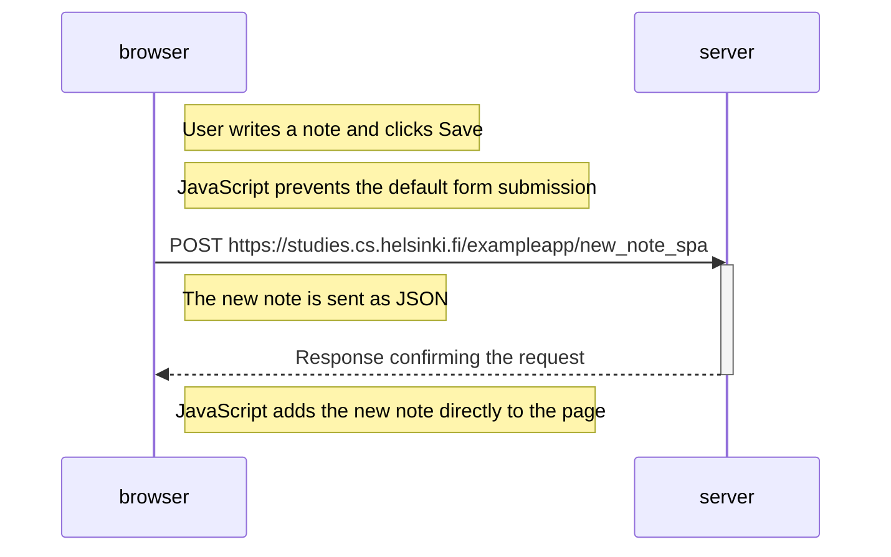

```mermaid
sequenceDiagram
    participant browser
    participant server

    Note right of browser: User writes a note and clicks Save

    Note right of browser: JavaScript prevents the default form submission

    browser->>server: POST https://studies.cs.helsinki.fi/exampleapp/new_note_spa
    activate server
    Note right of browser: The new note is sent as JSON
    server-->>browser: Response confirming the request
    deactivate server

    Note right of browser: JavaScript adds the new note directly to the page
```
